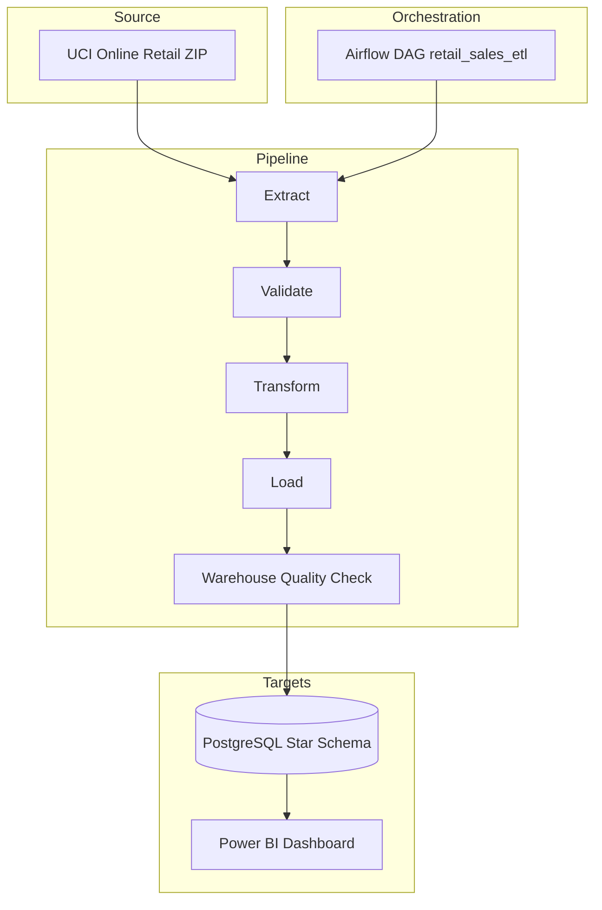
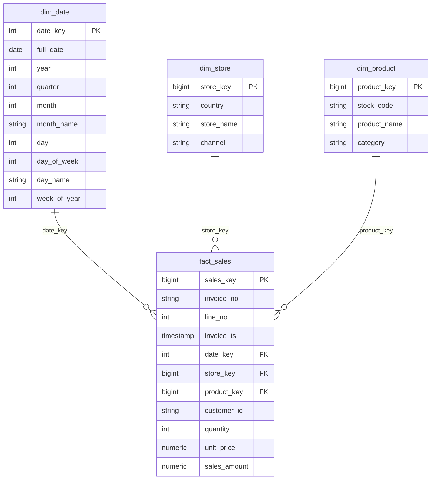

# Retail Sales ETL Pipeline

Production-style batch ETL pipeline that ingests a real public retail transaction dataset, validates data quality, transforms it into a star schema, and loads PostgreSQL for analytics and Power BI reporting.

## Project Status

| Area | Status |
| --- | --- |
| Extract / transform / load code | Done |
| Airflow DAG + Docker Compose stack | Done |
| Unit tests + GitHub Actions CI | Done |
| Incremental + idempotent reruns | Done |
| Power BI connection guide | Done |
| Runtime screenshots in `docs/images/` | Optional — add after local demo |

**Definition of done:** a fresh clone can install dependencies, pass tests, start the Docker stack, trigger the Airflow DAG, and load the warehouse with safe incremental reruns. CI runs lint and pytest on every push and pull request.

## Business Problem

Retail leaders need reliable sales reporting across time, product category, country/store market, and top-selling products. This project turns raw transaction exports into a governed warehouse model so BI dashboards can answer revenue and merchandising questions consistently.

## Prerequisites

- Python 3.11+
- Docker and Docker Compose (for PostgreSQL + Airflow)
- Make (optional, recommended)

## Quick Start

### 1. Tests and lint (fastest path)

```bash
cp .env.example .env
make install-dev
make ci
```

### 2. Full local stack (recommended demo path)

```bash
cp .env.example .env
docker compose up --build airflow-init
docker compose up --build
```

Airflow UI: http://localhost:8080 (`admin` / `admin`)

Trigger DAG: `retail_sales_etl`

PostgreSQL warehouse: `localhost:5432`, database `retail_warehouse`, user/password `retail`

### 3. CLI against exposed Postgres

Start Postgres first (`docker compose up postgres -d`), then point the CLI at localhost:

```bash
cp .env.example .env
# Set POSTGRES_HOST=localhost and DATABASE_URL with localhost (see .env.example)
make install
make etl
```

## Architecture



Pipeline order: `Extract -> Validate -> Transform -> Load -> Quality Check`.

Incremental state (`data/processed/incremental_state.json`) is written **only after** warehouse quality checks pass, so failed runs can be safely retried.

## Dataset

- Source: UCI Machine Learning Repository, **Online Retail**
- URL: https://archive.ics.uci.edu/dataset/352/online+retail
- Download URL: https://archive.ics.uci.edu/static/public/352/online+retail.zip
- License: CC BY 4.0, as listed by UCI
- Notes: The raw Excel file is downloaded automatically into `data/raw/` and is ignored by Git. The dataset contains real UK-based online retail transactions from 2010-2011.

## Warehouse ER Diagram



## Folder Structure

```text
.
├── .github/workflows/      # GitHub Actions CI
├── config/                 # Pipeline configuration
├── dags/                   # Airflow DAG
├── data/                   # Runtime raw/processed data, ignored by Git
├── docs/images/            # Screenshot/GIF placeholders
├── etl/                    # Extract, validate, transform, load code
├── gx/                     # Great Expectations checkpoint metadata
├── powerbi/                # Dashboard connection guide
├── sql/                    # DDL and sample analytical queries
├── tests/                  # Pytest unit tests
├── docker-compose.yml
├── Makefile
├── requirements.txt        # Runtime ETL dependencies
├── requirements-dev.txt    # Dev, test, and lint dependencies
├── requirements-airflow.txt
└── README.md
```

## Makefile Targets

| Target | Purpose |
| --- | --- |
| `make install-dev` | Install runtime + dev dependencies |
| `make ci` | Run lint and tests (same as CI) |
| `make etl` | Run the CLI pipeline |
| `make reset-state` | Delete incremental watermark for a full reload |
| `make docker-up` | Start Postgres + Airflow |
| `make airflow-init` | One-time Airflow DB migration and admin user |

## Docker Compose Services

- `postgres`: PostgreSQL 15 warehouse and Airflow metadata databases
- `airflow-init`: installs Python requirements, migrates Airflow metadata DB, creates admin user
- `airflow-webserver`: Airflow UI
- `airflow-scheduler`: DAG scheduler

## Data Quality

Validation runs in `etl/validate.py` before loading:

- source schema contains required columns
- invoice, product, description, date, quantity, and price null checks
- positive quantities and unit prices enforced in `clean_sales`
- duplicate checks for date, store, product, and fact business keys
- referential integrity checks between fact and dimensions

Checks are implemented in pandas so tests and CI stay lightweight. Great Expectations is installed in the Docker/Airflow runtime (`requirements-airflow.txt`) for GE-compatible execution.

Warehouse quality checks run after loading (`etl/quality.py`):

- fact table is non-empty
- no missing date/store/product references
- no duplicate fact business keys
- no null measures

## Incremental and Idempotent Loading

The pipeline stores the latest loaded invoice timestamp in `data/processed/incremental_state.json` as `last_invoice_ts`. Each run loads records with `InvoiceDate` strictly after that watermark.

PostgreSQL `ON CONFLICT` upserts dimensions and facts, so reruns do not duplicate rows. If a run fails before quality checks pass, the watermark is not advanced and the same batch can be retried safely.

To force a full reload:

```bash
make reset-state
```

## Power BI Dashboard

See `powerbi/README.md`. Connect Power BI to `localhost:5432`, database `retail_warehouse`, and import:

- `fact_sales`
- `dim_date`
- `dim_store`
- `dim_product`

Recommended visuals:

- Sales over time: line chart by `dim_date.full_date`
- Sales by category: bar chart by `dim_product.category`
- Sales by store: bar chart/map by `dim_store.store_name`
- Top products: ranked bar chart/table by `dim_product.product_name`

## Screenshots and Demo

After running locally, save runtime evidence in `docs/images/`:

- Airflow DAG screenshot: `docs/images/airflow-dag.png`
- Validation screenshot: `docs/images/great-expectations.png`
- Warehouse screenshot: `docs/images/warehouse.png`
- Power BI dashboard screenshot: `docs/images/powerbi-dashboard.png`
- Demo GIF: `docs/images/demo.gif`

These assets are optional placeholders and are not required for the pipeline to run.

## Troubleshooting

| Issue | Fix |
| --- | --- |
| CLI cannot connect to Postgres | Use `localhost` in `.env` when running outside Docker (see `.env.example`) |
| DAG succeeds but no new rows load | Expected when caught up; warehouse quality still validates existing data |
| Need to reload all history | `make reset-state`, then rerun the DAG or CLI |
| Tests fail with bare `pytest` | Use `make test` (`python -m pytest`) |

## Design Decisions

- UCI Online Retail was chosen because it is real, public, transaction-level retail data with stable automatic download.
- The store dimension is modeled as online country markets because the source is e-commerce data and does not expose physical store IDs.
- Product category is deterministically derived from product descriptions to support category-level BI without synthetic enrichment.
- Data files and BI binaries are excluded from Git to keep the repository lightweight and reproducible.
- Validation is pandas-first with Great Expectations available in Docker/Airflow for consistent runtime packaging.

## Future Improvements

- Add a hosted object-store landing zone for raw files.
- Add dbt models for warehouse transformations.
- Persist Great Expectations Data Docs as CI artifacts.
- Add Power BI template export once the local dashboard is finalized.
- Add an integration test job that loads a sampled file into PostgreSQL in CI.
