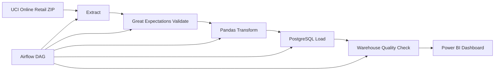
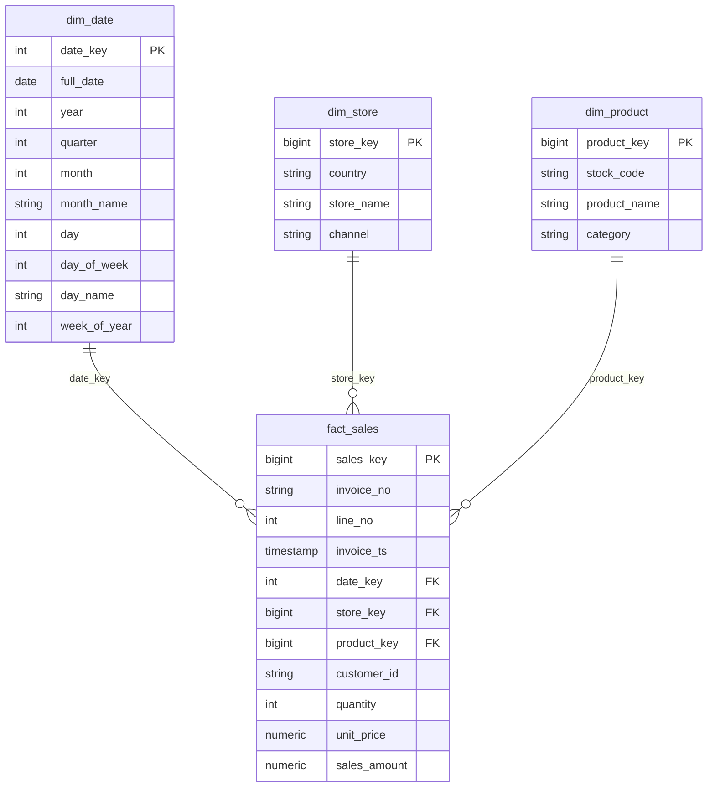

# Retail Sales ETL Pipeline

Production-style batch ETL pipeline that ingests a real public retail transaction dataset, validates data quality, transforms it into a star schema, and loads PostgreSQL for analytics and Power BI reporting.

## Business Problem

Retail leaders need reliable sales reporting across time, product category, country/store market, and top-selling products. This project turns raw transaction exports into a governed warehouse model so BI dashboards can answer revenue and merchandising questions consistently.

## Dataset

- Source: UCI Machine Learning Repository, **Online Retail**
- URL: https://archive.ics.uci.edu/dataset/352/online+retail
- Download URL: https://archive.ics.uci.edu/static/public/352/online+retail.zip
- License: CC BY 4.0, as listed by UCI
- Notes: The raw Excel file is downloaded automatically into `data/raw/` and is ignored by Git. The dataset contains real UK-based online retail transactions from 2010-2011.

## Architecture



Pipeline order: `Extract -> Validate -> Transform -> Load -> Quality Check`.

## Warehouse ER Diagram



## Folder Structure

```text
.
├── config/                 # Pipeline configuration
├── dags/                   # Airflow DAG
├── data/                   # Runtime raw/processed data, ignored by Git
├── docs/images/            # Screenshot/GIF placeholders
├── etl/                    # Extract, validate, transform, load code
├── gx/                     # Great Expectations checkpoint metadata
├── powerbi/                # Dashboard connection guide
├── sql/                    # DDL and sample analytical queries
├── tests/                  # Pytest unit tests
├── docker-compose.yml
├── Makefile
├── requirements.txt
└── README.md
```

## Setup

```bash
cp .env.example .env
make install
make test
```

Run the full local stack:

```bash
docker compose up --build airflow-init
docker compose up --build
```

Airflow UI:

- URL: http://localhost:8080
- Username: `admin`
- Password: `admin`

Trigger DAG: `retail_sales_etl`.

Run the ETL directly against a reachable PostgreSQL warehouse:

```bash
python -m etl.cli run
```

## Docker Compose Services

- `postgres`: PostgreSQL 15 warehouse and Airflow metadata databases
- `airflow-init`: installs Python requirements, migrates Airflow metadata DB, creates admin user
- `airflow-webserver`: Airflow UI
- `airflow-scheduler`: DAG scheduler

## Data Quality

Great Expectations checks run before loading:

- source schema contains required columns
- invoice, product, description, date, quantity, and price null checks
- valid positive quantities and unit prices
- duplicate checks for date, store, product, and fact business keys
- referential integrity checks between fact and dimensions

Warehouse quality checks run after loading:

- fact table is non-empty
- no missing date/store/product references
- no duplicate fact business keys
- no null measures

## Incremental and Idempotent Loading

The pipeline stores the latest loaded `InvoiceDate` in `data/processed/incremental_state.json`. On each run it loads records newer than that timestamp. PostgreSQL `ON CONFLICT` upserts dimensions and facts, so reruns do not duplicate rows.

## Power BI Dashboard

Connect Power BI to `localhost:5432`, database `retail_warehouse`, and import:

- `fact_sales`
- `dim_date`
- `dim_store`
- `dim_product`

Dashboard visuals:

- Sales over time: line chart by `dim_date.full_date`
- Sales by category: bar chart by `dim_product.category`
- Sales by store: bar chart/map by `dim_store.store_name`
- Top products: ranked bar chart/table by `dim_product.product_name`

## Screenshots and Demo

After running locally, save runtime evidence in `docs/images/`:

- Airflow DAG screenshot: `docs/images/airflow-dag.png`
- Great Expectations screenshot: `docs/images/great-expectations.png`
- Warehouse screenshot: `docs/images/warehouse.png`
- Power BI dashboard screenshot: `docs/images/powerbi-dashboard.png`
- Demo GIF: `docs/images/demo.gif`

## Design Decisions

- UCI Online Retail was chosen because it is real, public, transaction-level retail data with stable automatic download.
- The store dimension is modeled as online country markets because the source is e-commerce data and does not expose physical store IDs.
- Product category is deterministically derived from product descriptions to support category-level BI without synthetic enrichment.
- Data files and BI binaries are excluded from Git to keep the repository lightweight and reproducible.
- Great Expectations is used in code so validation runs consistently in both CLI and Airflow contexts.

## Future Improvements

- Add a hosted object-store landing zone for raw files.
- Add dbt models for warehouse transformations.
- Persist Great Expectations Data Docs as CI artifacts.
- Add Power BI template export once the local dashboard is finalized.
- Add CI that starts PostgreSQL and runs an integration ETL load on a sampled source file.
